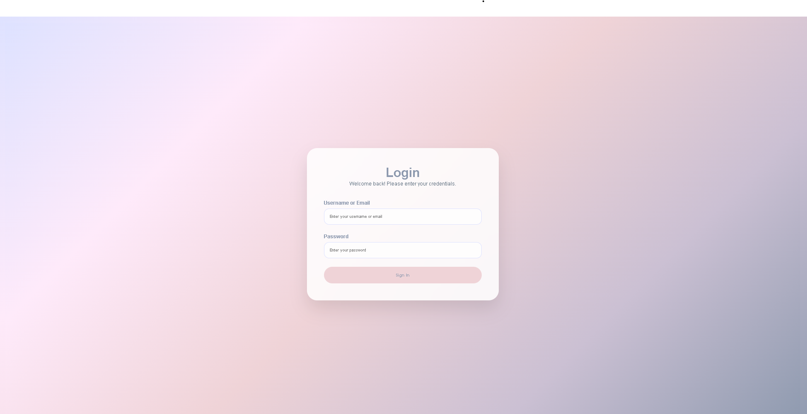
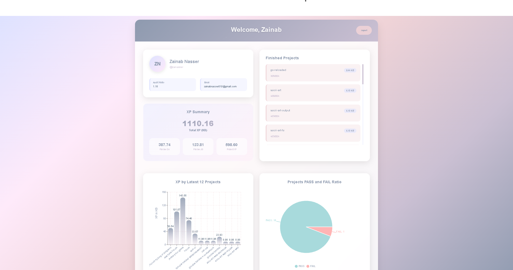

# GraphQL Student Profile Dashboard

 


A React-based dashboard that displays student information, XP progress, and project statistics by querying a GraphQL API.

## Features

- ✅ User authentication and protected routes
- 📊 Visualize XP earned across different programs
- 📈 Interactive charts for project statistics
- 🔍 Audit ratio tracking
- 🎯 Responsive design

## Technologies Used

- React 18
- Apollo Client (GraphQL)
- React Router
- Vite
- GitHub Pages (Hosting)
- Recharts (Data visualization)

## Live Demo

[View Live Demo](https://zainab49.github.io/Graphql2/)

## Installation

1. Clone the repository:
```bash
git clone https://github.com/zainab49/Graphql2.git
cd frontend   


